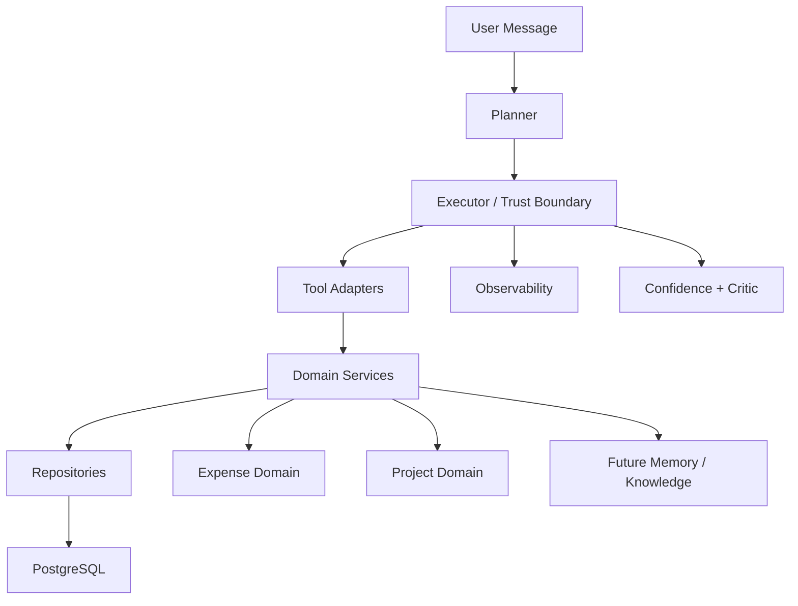

# RUX - AI Orchestration Engine

> A local AI orchestration backend that turns natural language into safe, persistent state changes with validation, observability, feedback, and critique.

## What RUX Is

Most toy agents look like this:

```text
LLM -> tool -> response
```

RUX is built around a stronger runtime contract:

```text
User
 -> Planner
 -> Executor (trust boundary)
 -> Tool Adapter
 -> Domain Service
 -> Repository
 -> PostgreSQL
 -> Observability / Outcome Tracking / Critique / Confidence
 -> Final Response
```

The core idea is simple: the LLM is not trusted. Anything before the executor is probabilistic. Anything after schema validation is expected to be deterministic, auditable, and safe to reason about.

## Architecture Snapshot




## Status

RUX is under active development and is currently being refactored toward a more modular domain-based architecture.

Current Focus : 
- SLO validation
- Planner eval
- Runtime extraction
- Production hardening

If you are reviewing this repo quickly, current proof points are:
- trust boundary + schema validation before tool execution
- auth + guardrails + per-endpoint rate limiting at API layer
- migration baseline with optional startup revision guard
- persisted run/outcome/feedback data for observability and confidence

## Benchmarks & Latency (current)

- Planner (Groq hosted): p50 ≈ 2s, p95 ≈ ~3s (depends on model and network)
- Analyze (no critic): p50 ≈ 6s (local baseline), improved when planner on Groq
- Log / Set Budget: higher when critic runs inline; use `CRITIC_NON_BLOCKING=true` for production latency

These numbers are reproducible with the included benchmark script in `scripts/benchmark.ps1` (see "Running Benchmarks" below).

## Running Benchmarks

Quick PowerShell benchmark that captures X-Process-Time-ms headers and run IDs. Place the file `scripts/benchmark.ps1` and run in PowerShell with your `X-API-Key` set.

Example (manual):

```powershell
$h=@{"x-api-key"="dev-key-change-in-production"}
#$body = @{user_id="rahul"; message="analyze food this month"} | ConvertTo-Json -Compress
#$r = Invoke-WebRequest -UseBasicParsing -Uri "http://127.0.0.1:8000/chat" -Method Post -Headers $h -ContentType "application/json" -Body $body
##$r.Headers["X-Process-Time-ms"]
```

## Key Design Decisions

### 1. The Trust Boundary

The Executor is where trust is established. LLM output is treated as untrusted input and must pass schema validation with `extra="forbid"` before any tool is called. This catches hallucinated field names, invented action types, and malformed JSON before they reach domain logic.

```text
LLM output         -> untrusted - can hallucinate anything
Executor (schema)  -> trust boundary
Tool onward        -> deterministic, validated, safe
```

### 2. Why the Planner Doesn't Call Tools Directly

LLMs are probabilistic. Tools are deterministic, state-mutating, and potentially destructive. Mixing these responsibilities makes the system harder to test, harder to reason about, and much easier to break.

```text
Planner  -> intent extraction only
Executor -> structural validation
Tool     -> domain gateway
Service  -> business rules
Memory   -> persistence
```

### 3. Three-Layer Planner

Not everything should reach the LLM.

```text
Layer 1 -> greeting keywords -> instant deterministic reply
Layer 2 -> action intent     -> LLM extracts structured JSON
Layer 3 -> open question     -> LLM responds conversationally
```

This protects confidence score integrity. Earlier, greeting-like inputs could accidentally flow into action logic and pollute outcome history.

### 4. Confidence from Data, Not from the LLM

Asking an LLM how confident it is usually produces weak signals. RUX is designed to calculate confidence from real historical outcomes:

```sql
SELECT domain, task_type,
       COUNT(*)         AS samples,
       AVG(was_correct) AS accuracy
FROM agent_outcomes
WHERE user_id = :user_id
GROUP BY domain, task_type
```

Confidence should only surface when there is enough history to justify it. Otherwise the system should return something like `"Confidence: insufficient data"` instead of fabricating certainty.

### 5. Critic Uses a Different Model

If the Planner and Critic use the same model, the Critic tends to agree with the original reasoning too easily. The idea behind RUX is that critique should be structurally independent, so the second opinion can challenge the first instead of just echoing it.

### 6. Security Baseline Before Scale

Before adding memory, caching, or worker complexity, RUX now applies a baseline security layer directly at the API boundary:

```text
X-API-Key auth -> blocks unauthenticated access
input guardrails -> bound and normalize user payloads
rate limits -> protect LLM and DB from burst abuse
```

This keeps the runtime stable while architecture work continues.

### 7. Schema Revision Guard at Startup

The app now supports a startup revision guard that verifies the running database revision matches the app's Alembic head.

```text
DB revision != app revision -> fail fast at startup
DB revision == app revision -> app starts normally
```

This avoids silent schema drift between local/dev/prod environments.

## Core Ideas

- **Trust boundary**: planner output is treated as untrusted until it passes schema validation.
- **Thin tools**: tools translate validated params into domain service calls.
- **Domain-first structure**: business behavior lives inside domains, not inside runtime glue.
- **Observable execution**: runs and outcomes are logged for inspection and feedback.
- **Confidence from history**: confidence is derived from past correctness, not model self-reported certainty.
- **Critique as a second layer**: decisions can be reviewed independently instead of trusting a single model pass.
- **Security before scale**: auth, validation, and rate limits are applied before advanced features.
- **Schema discipline**: Alembic revision alignment is treated as a deployment safety check.

## Current Domains

- **Expense**: expense logging, budget enforcement, spend analysis
- **Project**: project creation and deletion flows
- **In progress**: modular runtime cleanup, hybrid memory direction, future knowledge layer

## Current Structure

```text
rux/
├── api/                # FastAPI routes
├── core/               # runtime layer (planner/executor/auth/rate-limiter/guards)
├── domains/
│   ├── expense/
│   └── project/
├── repositories/       # shared persistence adapters
├── services/           # shared services + some legacy files
├── memory/             # legacy memory path, planned for refactor
├── migrations/         # Alembic migration scripts
├── tests/
├── alembic.ini
├── database.py
├── init_db.py
├── models.py
└── main.py
```

## Response Model

RUX is moving toward a shared internal tool contract:

- `ToolResponse.status`
- `ToolResponse.message`
- `ToolResponse.data`
- `ToolResponse.error`
- `ToolResponse.metadata`

This makes tool execution easier to validate, log, test, and later route cleanly through the executor.

## Tech Stack

- Python
- FastAPI
- SQLAlchemy async ORM
- PostgreSQL
- Alembic
- Pydantic
- Pytest
- Local LLM serving via LM Studio

## Environment & Security (important)

- Required env vars (minimum):
    - `API_KEY` — app API key for `X-API-Key` header (development default provided)
    - `LLM_PROVIDER` — `groq` or `lmstudio`
    - `GROQ_API_KEY` — Groq bearer token (do not commit)
    - `GROQ_BASE_URL` — `https://api.groq.com/openai`
    - `PLANNER_MODEL`, `CRITIC_MODEL` — exact model ids from `/models`
    - `CRITIC_NON_BLOCKING` — `true` to enqueue critic in background

## Setup

```bash
# Clone
git clone https://github.com/rahulT-17/RUX-AI-Companion.git
cd RUX-AI-Companion

# Create virtual environment
python -m venv .venv

# Activate (PowerShell)
.\.venv\Scripts\Activate.ps1

# Install dependencies
python -m pip install -r requirements.txt

# Apply database migrations (recommended)
alembic upgrade head

# Optional: enable startup schema-revision guard
$env:ENABLE_SCHEMA_REVISION_GUARD="true"

# Optional fallback for quick local bootstrap
# python init_db.py

# Run the API
python -m uvicorn main:app --reload

# Quick checks (use curl.exe on Windows)
curl.exe http://127.0.0.1:8000/
curl.exe http://127.0.0.1:8000/health

# chat
curl.exe -X POST http://127.0.0.1:8000/chat \
    -H "Content-Type: application/json" \
    -H "X-API-Key: your-api-key" \
    -d '{"user_id":"demo","message":"hello"}'

# feedback (run_id should be from a previous chat execution)
curl.exe -X POST http://127.0.0.1:8000/feedback \
    -H "Content-Type: application/json" \
    -H "X-API-Key: your-api-key" \
    -d '{"run_id":1,"user_id":"demo","was_correct":true,"correction":null}'

# debug endpoints
curl.exe -H "X-API-Key: your-api-key" "http://127.0.0.1:8000/debug/runs?limit=5"
curl.exe -H "X-API-Key: your-api-key" "http://127.0.0.1:8000/debug/slow_runs"
curl.exe -H "X-API-Key: your-api-key" "http://127.0.0.1:8000/debug/outcomes?limit=5"
curl.exe -H "X-API-Key: your-api-key" "http://127.0.0.1:8000/debug/confidence?user_id=demo&domain=project&task_type=create_project"
```

## What Works Now

- planner -> executor -> domain tool flow
- confirmation flow reuses shared finalization pipeline
- expense logging and budget enforcement
- project creation and deletion
- API key auth on `/chat`, `/feedback`, and `/debug/*`
- input guardrails for bounded and normalized request payloads
- per-endpoint in-memory rate limiting with `429 + Retry-After`
- standardized `X-RateLimit-*` headers on throttled responses
- Alembic baseline revision + startup schema-revision safety guard
- health endpoint for deploy/runtime probing (`GET /health`)
- database-backed persistence
- execution logging and feedback-oriented infrastructure
- smoke tests for expense and project tool adapters

## Observability & Debugging

- Use `/debug/runs` to list recent runs and inspect `result.metadata.stage_timings_ms` for `planning_ms`.
- Use `/debug/critic_result/{run_id}` to inspect background critic status and result.
- For slow-run breakdowns, inspect `result.metadata.execution_substages_ms` to see `tool_call_ms`, `decision_engine_ms`, `confidence_ms`, and `finalize_ms`.
- When troubleshooting LLM provider issues, test directly with the provider's `/models` and `/chat/completions` endpoints using the same `GROQ_API_KEY` in your shell.

## Roadmap

- [ ] Add CI gate for migration drift (fail when models change without migration)
- [ ] Add integration tests for `/chat`, `/feedback`, and `/debug/*`
- [ ] Add global API exception handling for cleaner failure paths
- [ ] Harden LLM timeout/error fallback behavior for `/chat`
- [ ] Continue runtime extraction (`action_catalog`, cleaner composition root)
- [ ] Remove legacy duplicated service/repository files
- [ ] Build hybrid memory: short-term, episodic, semantic retrieval
- [ ] Add a knowledge layer for reusable facts, concepts, and sources
- [ ] Improve deployment and production config hygiene

## Why I Built This

I built RUX to understand what actually breaks in AI agent systems when you move past demos: unreliable tool calls, weak trust boundaries, missing feedback loops, and no real way to measure correctness over time.

The goal is not to build another chatbot wrapper. The goal is to build the runtime layer underneath an AI agent system: validation, orchestration, observability, critique, and eventually memory and knowledge.

---

*Production-minded and actively evolving.*